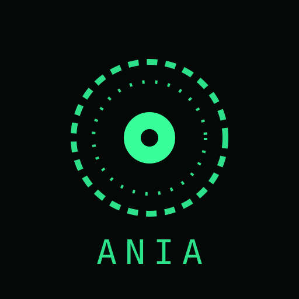

  <h1>ANIA</h1>
  
  
<strong>Asistente personal, secretaria ejecutiva y compañera en un solo archivo HTML</strong>

  
<em>voz · personalidad propia · memoria · música procedural · agente de PC · entrenamiento con documentos · modo offline</em>

  

    
    
    
    
    
    
  

---

    » ANIA KERNEL v6.0 · núcleo personal
    » LINGUA: cubano + typos + tildes ... OK
    » escucha continua: palabra «Ania» .. OK
    » música procedural + agente PC ..... OK
    » esperando credenciales del operador _

      > que bolá
      ANIA ▸ ¡Hola! ¿Misiones o sobremesa?
      > ania, ponme musika
      ANIA ▸ Lo-fi procedural en marcha.
            (sin tilde y con typo: entendido igual)

**Ania** no es un chatbot genérico: es un personaje con identidad completa — 20 años, egresada
de la Academia Eden, especialista en isekai, zombies, café de especialidad, astronomía y
tecnología — con voz femenina, memoria de usuario, agenda recurrente, entrenamiento con tus
propios documentos, control del PC mediante un agente opcional, y **te acompaña incluso sin
internet**. Le escribes normal, con typos, sin tilde o en cubano: «klima», «que bolá, abre mi pc».

Creada por **Carlos Lorenzo Marros**.

---

## » Características

| Módulo | Qué hace |
|---|---|
| LINGUA | Entiende sin tilde, con typos, coloquial y cubano (corrección difusa + fonética del micrófono) |
| Voz bidireccional | Voz femenina en español + micrófono, con escucha continua opcional: di «Ania» y obedece |
| Agente del PC (opcional) | «abre mi pc», «sube el volumen», «captura mi pantalla», «apaga la pc», «busca en toda la pc» |
| Índice del PC | Encuentra tus películas/archivos indexando carpetas, 100% local |
| Música procedural | Lo-fi en vivo con WebAudio: acordes de jazz, vinilo, ritmo. Sin archivos, sin internet |
| Secretaría ejecutiva | «prepara mi día» (informe), reuniones con pre-aviso, redacción de correos |
| Agenda + recordatorios | Recurrentes («todos los días»), canales separados web/Telegram, «pospón 10 minutos» |
| Memoria de usuario | «me llamo Carlos» → lo recuerda para siempre |
| Login multiusuario | usuarios.json con caché offline y modo invitado |
| Entrenamiento | Documentos propios (txt/docx/pdf) + JSON de respuestas fijas editable en el HTML |
| Biblioteca offline | Cada búsqueda de Wikipedia se guarda y se lee sin conexión |
| Clima y astro | Clima real, fase lunar y lluvias de meteoros (cálculo local offline) |
| IA conversacional | Gratuita y sin clave (Pollinations) con la personalidad de Ania |
| Diario y backup | Bitácora diaria automática + exportar/importar todo |
| PWA instalable | App a pantalla completa; con service worker funciona sin conexión |

---

## » Empezar

**Opción A · Uso local:** descarga `index.html` y ábrelo con Chrome/Edge. Funciona sin internet:
personalidad, memoria, agenda, música, PC, luna y charla. Solo clima/búsqueda/IA usan red.

**Opción B · GitHub Pages:** Settings → Pages → Branch `main` / root → Save. Ábrela en el móvil
(Chrome) → menú ⋮ → Instalar aplicación. Instalada, funciona sin conexión.

**Opción C · Agente del PC (opcional):**

    cd agente
    npm install ws
    node ania-agent.js

Luego en Ania: «conecta el agente con clave [tu-token]». El puente escucha solo en 127.0.0.1,
exige token y usa listas blancas de apps y rutas. Auto-inicio: copia `agente/ania-agent.vbs`
en shell:startup.

---

## » Login

Las credenciales se leen en vivo de:

    https://raw.githubusercontent.com/calm291094-del/meditech-tienda/main/usuarios.json

La lista se cachea en el dispositivo (login offline) y la sesión se recuerda entre visitas.
Existe modo invitado. Aviso: las contraseñas van en texto plano en un repo público; para
blindarlo, valida el login en el backend con hashes (bcrypt/argon2).

---

## » Comandos que Ania entiende

<strong>Ver la lista completa</strong>

| Categoría | Ejemplos |
|---|---|
| Escucha activa | «siempre escúchame» → luego «Ania, ...» |
| PC (agente) | «abre mi pc» · «sube el volumen» · «captura mi pantalla» · «bloquea el pc» · «apaga la pc» · «lee mi portapapeles» |
| PC (índice) | «indexa mi pc» · «busca en la pc [película]» · «abre el resultado 2» |
| Música / ambiente | «ponme música» · «pon [canción] en youtube» · «pon lluvia» · «pon la cafetería» |
| Secretaría | «prepara mi día» · «reunión con Ana a las 15:00» · «redacta un correo a Luis» |
| Agenda | «recuérdame tomar agua todos los días a las 9 am» · «mis tareas» · «tarea hecha» · «pospón 10 minutos» |
| Memoria | «me llamo Carlos» · «me gusta el café» · «¿qué sabes de mí?» |
| Astro | «¿qué fase tiene la luna?» · «próxima lluvia de estrellas» |
| Clima | «¿cómo está el clima?» · «¿dónde estoy?» · «clima en Bogotá» |
| Conocimiento | «busca agujeros negros» · «¿quién es Ada Lovelace?» · «traduce hola al japonés» |
| Documentos | «entrena con mis documentos» · «busca en mis documentos [tema]» |
| Extras | «calcula 12*9+3» · «convierte 5 km a millas» · «genera una contraseña» · «adivina mi personaje» |

Todo funciona igual escrito «rekuerdame», «klima» o «que bolá».

---

## » Entrenamiento con documentos

**Por GitHub (público):** sube archivos a `documentos/` y lista sus nombres en
`documentos/indice.json`:

    ["apuntes.txt", "recetas.docx", "manual.pdf"]

**Por carpeta local (privado):** «entrena con mis documentos» → eliges la carpeta → nada
sale de tu dispositivo. Además, al final de `index.html` hay un JSON interno editable con
respuestas fijas que Ania prioriza.

---

## » Estructura del repositorio

    ania/
    ├── index.html      ← toda la aplicación
    ├── manifest.json   ← PWA
    ├── icon.svg        ← icono de la app
    ├── sw.js           ← service worker (caché offline)
    ├── fondo.png       ← imagen de portada
    ├── documentos/     ← entrenamiento (indice.json + tus archivos)
    ├── agente/         ← puente del PC (opcional)
    └── README.md

APIs usadas, todas gratuitas y sin clave: Open-Meteo (clima), Nominatim (geolocalización),
Wikipedia, DuckDuckGo, MyMemory (traducción), Pollinations (IA), más las APIs nativas del
navegador (voz, notificaciones, batería, vibración).

---

## » Problemas conocidos

<strong>Ver soluciones rápidas</strong>

| Problema | Solución |
|---|---|
| Actualicé index.html pero sale la versión vieja | Sube también sw.js con el caché subido (ania-v6 → ania-v7) |
| El micrófono no responde | Solo Chrome/Edge; revisa permisos del sitio |
| Ania no habla | El primer toque habilita el audio; prueba «habla» |
| La escucha activa se apaga | Ania la reenciende sola; Android la congela en reposo profundo |
| La captura de pantalla falla | Requiere la sesión de Windows desbloqueada |
| El agente no conecta | ¿Corre node ania-agent.js? ¿Token idéntico? El pill AGENTE del header lo confirma |
| El login falla sin conexión | Solo la primera vez; luego queda cacheado |

---

## » Hoja de ruta

- [x] Reconocimiento de voz continuo con palabra de activación
- [x] Entrenamiento con documentos propios
- [x] Control del PC vía agente local
- [x] Agenda recurrente con canales separados
- [ ] Hash de contraseñas validado en backend
- [ ] Sincronización de memoria entre dispositivos
- [ ] PIN local de bloqueo
- [ ] Trivia y más juegos

---

## » Créditos y licencia

Ania — concepto, diseño y personalidad: **Carlos Lorenzo Marros**.

Licencia **MIT**. Llévate tu propia Ania a donde quieras... solo dale buen café.

*«Pan, café y anime: la trinidad de la felicidad.»* — **Ania**

